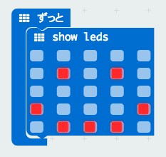
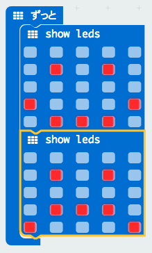
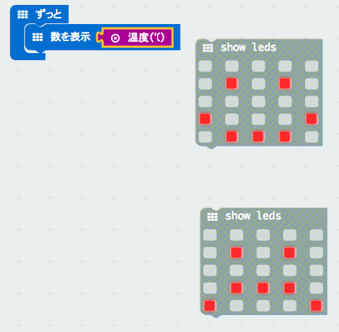
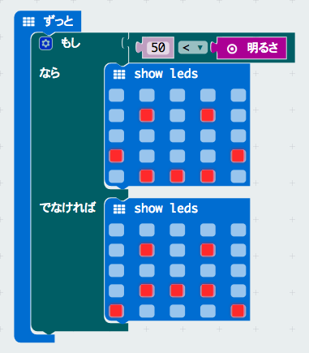

# はじめてのmicro:bitワークショップ

この文書は[CC BY-SA 4.0](https://creativecommons.org/licenses/by-sa/4.0/deed.ja)にしたがって公開する。

## 「はじめてのmicro:bit」ワークショップとは？

プログラミング可能な小さなコンピューター[micro:bit](http://microbit.org/ja/)を使い、LEDやボタン、センサーといったハードウェアを使ったプログラミングを体験するワークショップである。この文書はワークショップを進行するファシリテーター向けに書かれている。ワークショップは初心者を対象に最短で45分、発展を入れて2時間くらいまで対応する。

2018年7月に開催された[環境エネルギー・ラボ2018inせたがや](http://ene-lab.com/)において、[CoderDojo 調布](http://coderdojochofu.hatenablog.jp/)のメンバーによっておこなわれた「小中学生IoTプログラミング道場」ワークショップの内容を元にしている。

## 準備

以下のものを準備する必要がある。

- micro:bit([スイッチエデュケーション](https://switch-education.com/)より購入可能)
- インターネットに接続可能でUSBポートがついているパソコン
- データ転送が可能なマイクロUSBケーブル(充電のみ可能なものは不可)
- マウス(パソコン初心者の参加者には特に必要。マウスを使う場合パソコンのUSBポートは2つ以上必要)

micro:bitに転送するプログラムは、ブラウザ上で開く[MakeCode](https://makecode.microbit.org/#lang=ja)で作成するので、ブラウザがプレインストールされているパソコンに新たにプログラムをインストールする必要はない。ただし、プログラムファイルをパソコンからmicro:bitにコピーする際のファイル操作には、ドラッグアンドドロップのやや煩雑な操作が必要なため、それを省略できる[micro:bit uploader ](https://www.touchdevelop.com/microbituploader)(Windows環境のみ)をインストールしておくことをおすすめする。

OSとブラウザの組み合わせは、MakeCodeがサポートするものならばどれでも可能だが、この文書はWindows 7 + Chromeという環境でおこなったワークショップの内容を元にしている。

micro:bitには、工場出荷時に入っているデモプログラムをコピーしておく。まっさらなmicro:bitであれば、そのままで良いが、そうでない場合は、[Reset the micro:bit to factory defaults](
https://support.microbit.org/support/solutions/articles/19000021613-reset-the-micro-bit-to-factory-defaults)の「download and flash this .hex file」のリンク先のhexファイルをあらかじめコピーしておく。

## はじめに

1. プログラミングがまったく初めてという参加者向けに、「プログラミングとは、コンピューターに命令すること。運動会のプログラムのように、やることを順番に並べる必要がある。」と説明する。

1. 炊飯器や電子レンジ、エアコンといった家電やNintendo SwitchやDSといったゲーム機器、スマホにもコンピューターが入っている。たとえばエアコンには温度センサーがついており、温度が高くなったら、クーラーを強めにするというプログラムが動いている。

1. 電源が入ったmicro:bitを見せて、今からみなさんに触ってもらうこのmicro:bitにもコンピューターが入っていること、そしてそのコンピューターで動くプログラムはパソコンで作ってもらうこと、またmicro:bitには温度センサーや明るさセンサーといった各種センサーもついていることを説明して、前述の説明と関連していることに気づいてもらう。

## デモプログラムでmicro:bitで何ができるかを体験

1. 電源が入っていてLEDが点灯しているmicro:bitを見せ、参加者の手元のLEDが点灯していないmicro:bitには電源が入っていないことを説明。電源を供給するためにパソコンに接続しましょう、と言ってmicro:bitとパソコンを接続してもらう。USBポートが2つ以上両端についているパソコンの場合は、利き腕の側にマウスを、反対側にmicro:bitを接続してもらうのがよい。

1. LEDが点灯し、デモプログラムが動き出す。何と表示されているかを参加者に聞く。「← A」という表示が何を意味するのかに気づいてもらう。やがて、矢印が指しているボタンを押すのではないか、あるいはボタンの下にAと書いてあることに気づくので、その通り押す。

1. 次に「B →」という表示に切り替わるので、Bボタンを押す。

1. 「SHAKE!」という表示に切り替わる。SHAKEというのは英語で「振る」という意味であることを教え、指示通りmicro:bitを振る。

1. 「CHASE THE DOT!」という表示に切り替わる。英語で「点を追いかけろ」という意味であることを教え、指示の通り、点滅している点を、点滅していない点でつかまえる。micro:bitを前後左右に傾けることで点滅していない点を動かすことができることに気づいてもらう。

1. 「NOW GET CODING!」という表示に切り替わる。英語で「さあ、プログラミングを始めよう」という意味だよと伝える。今動いているプログラムは、micro:bitに最初から用意されているデモプログラムで、micro:bitで何ができるか、をみなさんに知ってもらうためのもの。LEDが光る、AとBボタンがある、振ることができる、傾きを検知できる、ことがわかった。これからいよいよ自分でmicro:bitを動かすためのプログラミングをします、目の前のパソコンで表示されているMakeCodeでそのプログラムを作ります、と伝える。

## LEDでアニメーション

1. まずはLEDを光らせてみよう、ということで、基本 > show leds のブロックを「ずっと」のブロックの中にはさむ。ファシリテーターは「うれしい顔」を描いてみせるが、真似しても良いし、自由に描いてもいいよと伝える。

    

1. makecode の左側に、プログラムで描いた絵柄がmicro:bitのシミュレーターに表示されていることを示す。うまく表示されているなら、「ダウンロード」ボタンを押してmicro:bit本体にhexファイルをコピーする。

1. micro:bit本体でもプログラム通り表示されていることを確認したら、次に違う絵柄を先に置いたshow ledsの次につなげる。ファシリテーターは「悲しい顔」を描くが、真似しても良いし、自由に描いても良い。シミュレーターで2つの顔（絵柄）が交互に表示されてアニメーションしていることを確認する。

    

1. 「ずっと」のなかではプログラムが繰り返しループしていることを説明する。つまり1つ目の絵柄を表示したあと2つ目の絵柄を表示する。そのあと、プログラムは終わるのではなく、始めに戻る。そしてまた、1つ目の絵柄を表示、2つ目の絵柄を表示、そしてまた始めに戻るので、繰り返し絵柄が交互に表示されるのだ、と説明する。

1. 「ダウンロード」ボタンを押してmicro:bit本体でも絵柄がアニメーションすることを確認する。

## 温度/明るさセンサーを使ってみよう

1. 温度センサーの値を表示してみる。「ずっと」のブロックの中の「show leds」のブロック2つをいったん外す。

1. 温度は29、30といったように数字なので、基本 > 数を表示 のブロックを使います。ずっとの間にはさみ、入力 > 温度(℃)のブロックを 0 の部分に入れる。

    

1. シミュレーターには偽の温度が表示されていると説明。「ダウンロード」ボタンを押してmicro:bit本体にプログラムをコピーして実際の温度を読み取る。(厳密にはmicro:bitは温度センサーを持っていない。表示されているのはCPUの温度だ)

1. 次に明るさを表示してみる。「温度」のブロックの代わりに「明るさ」のブロックに入れ替える。シミュレーターでは黄色とグレーが半々ずつになった円の部分を操作することにより、擬似的な明るさを変えることができることを示す。

    

1. 「ダウンロード」ボタンを押してmicro:bit本体にプログラムをコピーする。明るいときは大きな数字が、暗いときには小さな数字が表示される。手で隠したり、あるいはスマホのライトをmicro:bitに当てることで数字の大きさが変わることを体験してもらう。暗いときの数字の値と明るいときの数字の値をだいたいで良いので覚えておいてもらう。

## 明るさに応じてLEDの表示を変えてみよう

1. 明るさによってLEDの表示が変わるプログラムを作ってみる。共同住宅や施設のライトが夕方くらいになると自動で点くのと同じような仕組みだよ、と説明する。

1. 条件分岐には 論理 > もし…なら…でなければ のブロックを使う。

1. さきほど覚えてもらった暗いところの明るさセンサーの値と、明るいところの明るさセンサーの値の真ん中あたりの数をしきい値として、「[しきい値] < 明るさ」のブロックを作り、「もし」のあとにつなげる。

1. 最初につくった2つの絵柄の一方を「なら」のあとにつなげ、もう一方を「でなければ」のあとにつなげる。

    

1. シミュレーターで明るさを変えると絵柄が変わることを確認したら、micro:bit本体にプログラムをコピーする。明るさを変えることで絵柄が変わることを確認する。

## 自由制作

1. これで一通りmibro:bitの基本の説明は終わり。このあと、時間に余裕があるなら、教わったことを応用して自由に作品をつくってもらう。makecodeでどんなに間違ったコードを作ってもパソコンもmicro:bitも壊れないので、安心して試行錯誤しても良いことを伝える。

 この 作品 は <a rel="license" href="http://creativecommons.org/licenses/by-sa/4.0/">クリエイティブ・コモンズ 表示 - 継承 4.0 国際 ライセンス</a>の下に提供されています。
